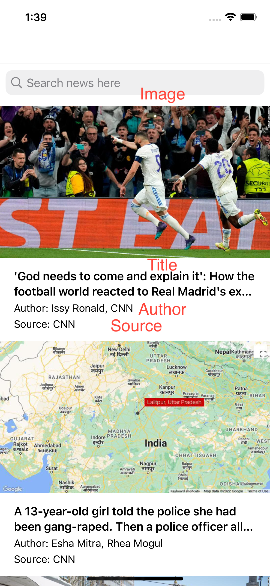
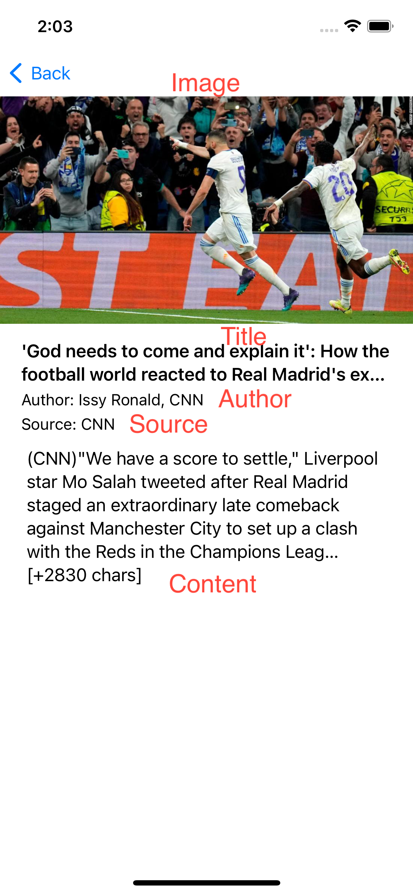

# CityExperienceiOSTest

## Goal:

| Goal               |
| ------------------ |
| List the articles, display the following for each article: Source name, Author, Title, Image (If available)
| When clicking on the item/row, it should take you to a DetailViewController, where it shows detailed info such as: Source name, Author, Title, Image (If available), Content
| Infinite scrolling
| Pull to refresh
| Use searchbar to dynamically fetch content related to user’s search

## Flow of result:

BasicFunction - 

## Sreenshoot:

ListViewController - 

DetailViewController -

