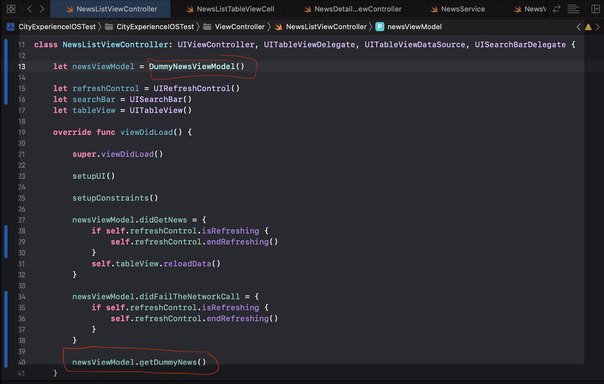
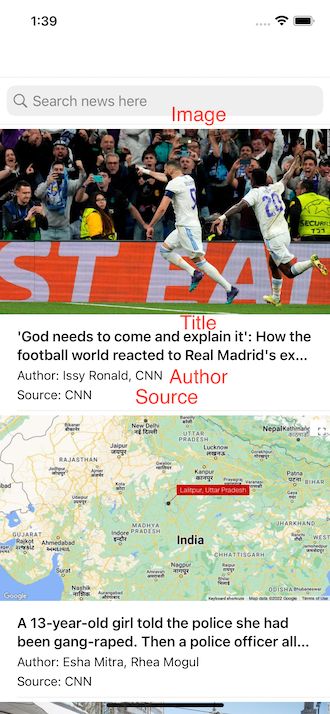

# CityExperienceiOSTest

## Goal:

| Goal               |
| ------------------ |
| List the articles, display the following for each article: Source name, Author, Title, Image (If available)
| When clicking on the item/row, it should take you to a DetailViewController, where it shows detailed info such as: Source name, Author, Title, Image (If available), Content
| Infinite scrolling
| Pull to refresh
| Use searchbar to dynamically fetch content related to user’s search

## Library Usage

| Library               | Usage
| ------------------ | -----
| Alamofire | Network Call
| SnapKit | AutoLayout 
| SDWebImage | Async download image and cahce image

## Usage

As there is difficulty in applying API key, this project is divided in 2 parts:   
First part is using dummy json respond and view model to demostrate basic funcion with image and content.   
The advance fucntion do not work with first when using dummy view model.   

Second part is using normal view model to demostrate advanced function.   
Following steps are prerequestie.

## Prerequestie to use dummy json

Update the NewsListViewController:   
Amend line 13 to initialize DummyNewsViewModel  
Add newsViewModel.getDummyNews() in viewDidLoad to fetch the respond

## Prerequestie to use the real api

Update the NewsListViewController:  
Amend line 13 to initialize NewsViewModel  
Delete newsViewModel.getDummyNews() in viewDidLoad

Insert the APIKey in NewsService

## Flow of result:

BasicFunction - 

Advanced Function - 

## Sreenshoot:

ListViewController - 

DetailViewController -

Search -

 

Infinite Scrolling -

 

Pull To refresh -

